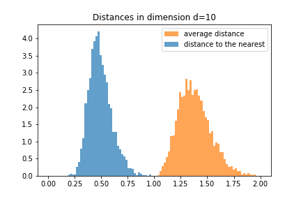
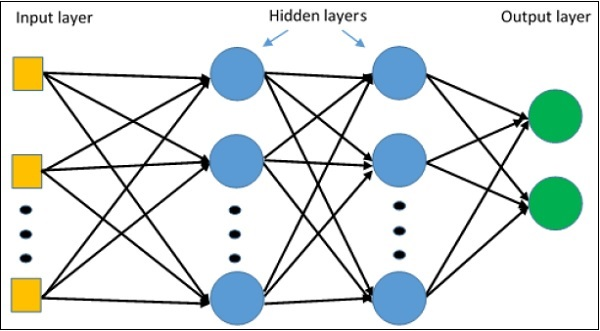

class: center, middle

# AMMI Deep Learning DIY:
# Day 3
Timothée Lacroix, Pierre Stock, Alexandre Sablayrolles

---

class: center, middle

# Welcome to the high dimension

---

# High dimension: what ? why ?

- Most "real world" data is in high dimensions

--
- Why ?

--
- Multi-dimensional data: each axis represents a feature

--
  - Food (sweetness, sourness, bitterness, saltiness, color, ...)

--
- Some data has very very high dimensionality

--
  - Images: \\(~500 \times 300 \times 3 = 450,000 \\)

--
  - Text: Vocabulary is \\(\approx 10,000\\) words

--
  - The list goes on!

---
# The surprises of high dimension

- The high dimension is not what you think it is

--
  - It is not like the 2D or 3D world we live in

--
- Distribution of distances to the nearest neighbour

---
name:high_dim_surprise
# The surprises of high dimension

- The high dimension is not what you think it is
  - It is not like the 2D or 3D world we live in
- Distribution of distances to the nearest neighbour

---
template:high_dim_surprise

  

---
template:high_dim_surprise

  

---
template:high_dim_surprise

  

---
template:high_dim_surprise

  

---
template:high_dim_surprise

  

---
template:high_dim_surprise

  

---
template:high_dim_surprise

  

---
template:high_dim_surprise

  

---
template:high_dim_surprise

  

---
template:high_dim_surprise

  

---
template:high_dim_surprise

- In high dimensions, the "nearest" neighbor is actually very far
  - It almost is as far as the all the other points

---
# Embeddings

- We talked about high-dimensional data that is __interpretable__

--
  - Food: different features

--
  - Images: colors values of the pixels

--
  - Text: words of the vocabulary

--
- Sometimes we have vectors that are not interpretable

--
  - activations of a neural network

---
# Neural networks

- A neural network is a stack of linear layers and activation functions

--
  - the linear layer is a weight matrix \\( W \\) and a bias \\(b \\):
$$ h = W x + b $$

--
  - the activation function can be \\( \sigma \\) (sigmoid), ReLU
$$ h = \sigma(x) = 1 / (1 + \exp(-x)) $$
$$ h = ReLU(x) = \max(x, 0) $$

---
# Neural networks

- A neural network is a stack of linear layers and activation function
  - Input layer: typically image, text, etc.
  - Output layer: our target (typically a class)
  - Hidden layers: intermediate representations learned by the neural net

  

---
# Neural networks: analysis

- How can we understand what happens in the neural network ?

--
  - We can compute the hidden layer activations for a bunch of inputs

--
  - This gives us __vectors__ in some dimension (e.g. 256, 512)

--
  - This vectors are not easily interpretable: their dimension do not correspond to intuitive quantities like pixels, etc.

--
  - We cannot understand what each dimension does but we can understand what the vector represents __globally__

---
# Understanding high dimensional data ?

1. Visualization: PCA (linear)
2. Visualization: t-SNE
3. Metrics (black-box approach)
