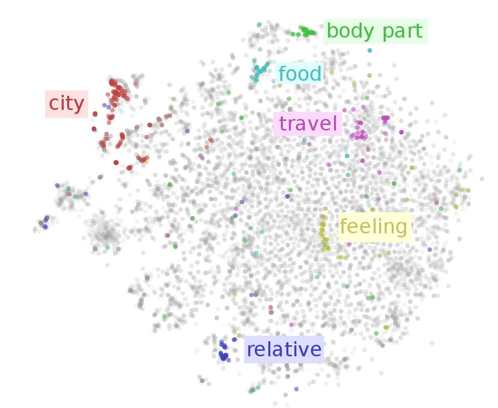

class: center, middle

# AMMI Deep Learning DIY:
# Day 8
Timothée Lacroix, Pierre Stock, Alexandre Sablayrolles

---

class: center, middle

# Natural Language Processing (NLP)

---
name:applications
# Some applications of NLP

- Why are we interested in Natural Language Processing ?
---
template:applications
- Conversations & chatbots

  

---
template:applications
- Text classification / sentiment analysis

  

---
template:applications
- Machine translation

  

---
template:applications
- Question answering

  

---
template:applications
- +audio: Speech recognition

  

---
template:applications
- +image: Image captioning

  

---
# Natural Language Processing

1. Word vectors
2. Recurrent models: RNN, LSTM

---
# Word vectors / embeddings

- We want to represent each word by a vector (or embedding)

--
- Why ?

--
  - Our machines (linear regression, neural nets) work with vectors (i.e. feature representations)

---
# Word vectors

1. Learning word vectors

--
  - word2vec (skip-gram, CBOW)

--
2. Properties of learned word vectors

--
  - linear relationships, neighbors, bias

--
  - visualization

--
3. Transferring to downstream applications

--
  - text classification / sentiment analysis

--
  - embedding layers

---
# Learning word vectors

- Word vectors can be learned in an unsupervised way

--
- Given a corpus of text, we predict a word from its context

  

---
# Learning word vectors

- Word2vec (Mikolov et al. 2013)

--
  - CBOW: predict a word from its context

--
  - Skip-gram: predict the context from the word

--

  

---
# Properties: linear relationships

- Linear relationships between words
  - There are "directions" in the learned space
  - ex: country-capital, male-female, etc.

  

---
# Properties: nearest neighbors

- Nearest neighbors of points are often semantically related

  

---
# Properties: visualization

- T-SNE plot of word embeddings

  

---
# Properties: bias!

- Our representation can be biased!

--
- This is not something we want, but we have to be aware of it

--

  

--
- Why do we have bias ?

--
  - Our data is biased

--
  - We did not do anything to correct it

--
- Bias can be removed

--

  

--
- This is still an active research topic

---
# Transfer: linear models

- We can obtain word vectors "for free": we only need text corpora

--
  - books

--
  - websites (news, blogs)

--
  - etc.

--
- We can now use these word vectors for text classification

--
- Sentences are represented with the so-called "bag of words"

--
  - Each sentence is the average of all its word embeddings

--
  - We train a simple linear model on top of it

---
# Transfer: embedding layer

- Word vectors can be used as the first layer in a neural network
- More on that later

---
# Recurrent neural networks

- Main idea: we predict the next word in a sentence from the current word and the past
- The past is represented by a hidden state \\(h_{t-1}\\)
- The current word is \\(w_t\\) and its embedding is \\(x_t\\)
- We compute the current state by the equation:

  

- We predict the next word using \\(h_t\\)

---
# Recurrent neural networks

  

  

---
# Recurrent neural networks

- Also do unsupervised learning!

--
  - We predict the next word with the current word

--
- There are fancier versions of RNN (LSTM)

--
- It was observed that the gradient of RNN blows up

--
  - Why ?

--
  - At each time step, we backpropagate the gradient to the previous time step by multiplying it with a matrix

--
  - After \\(t \\) steps, it can blow up or vanish exponentially

--
  - This is called the exploding/vanishing gradient problem

--
  - It has a simple solution: gradient clipping

--
  - If the norm of the gradient is higher than some threshold, we rescale it
